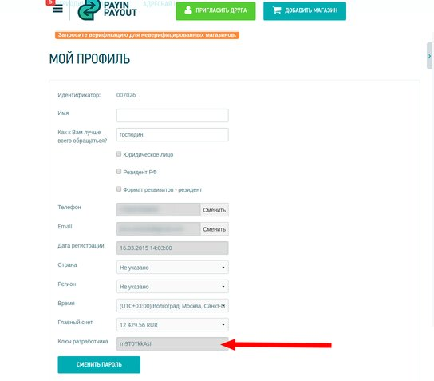

# Расчёт хэша безопасности

Для проверки достоверности передаваемых данных используется
[hash-based message authentication code](https://ru.wikipedia.org/wiki/HMAC), в качестве хэш-функции
используется md5.

Общий секретный ключ, который используется для генерации хэшей, можно найти в профиле пользователя:

[](images/profile-developer-key.png)

Предварительно его генерацию необходимо запросить у менеджмента системы Payin-payout.

Строка используемая для генерации хэша состоит из данных POST-запроса, отсортированных и представленных в виде
URL-кодированной строки запроса.

Пример генерации хэша на PHP:

```php
<?php
$paramPost = [
    'phone_code' => '8789',
    'email_code' => '5995',
    'registered_user_id' => '12345',
    'user_id' => 1111,
    'timestamp' => time(),
];
uksort($paramPost, 'strcasecmp');
$data_string = http_build_query($paramPost, '', '&');
$hash = hash_hmac('md5', $data_string, 'secret_key');
```

## Метка текущего времени в параметрах

Обязательным параметром является timestamp который обеспечивает уникальность hash для
запросов с одинаковыми параметрами. Timestamp должен представлять собой метку времени Unix по UTC
в секундах.

При проверке подписи проверяется значение timestamp, оно не должно отличаться от текущего времени
более чем на 10 секунд.

Если это условие не соблюдается, выдаётся ошибка:

```json
{
  "status": false,
  "user_msg": "incorrect timestamp",
  "tracker": " gid_5ce3bc0f822fe7.00401015"
}
```
